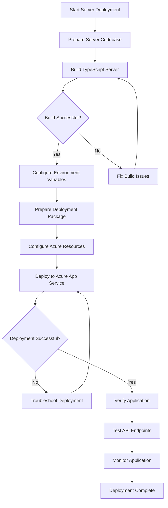

# Azure App Services Server Deployment Workflow

This document outlines the step-by-step workflow for deploying the server component of the AIVA application to Azure App Services.

## Workflow Chart

## Detailed Steps

### 1. Prepare Server Codebase
- Ensure all server code is committed and up-to-date
- Verify [server/package.json](file:///c:/Users/chint/Downloads/webappm/web-app/server/package.json) contains correct dependencies
- Check that [server/.env](file:///c:/Users/chint/Downloads/webappm/web-app/server/.env.cleaned) or environment variables are properly configured

### 2. Build TypeScript Server
- Navigate to the server directory: `cd server`
- Run the build command: `npm run build`
- This compiles TypeScript files in [src/](file:///c:/Users/chint/Downloads/webappm/web-app/server/src/) to JavaScript in [dist/](file:///c:/Users/chint/Downloads/webappm/web-app/server/dist/)

### 3. Configure Environment Variables
- Set all required environment variables in Azure App Service:
  - Database configuration (SQL_SERVER, SQL_DATABASE, SQL_USERNAME, SQL_PASSWORD)
  - Azure authentication (AZURE_CLIENT_ID, AZURE_CLIENT_SECRET, AZURE_TENANT_ID)
  - JWT configuration (JWT_SECRET)
  - Azure services (AZURE_STORAGE_ACCOUNT_NAME, AZURE_OPENAI_ENDPOINT, etc.)
- Use the [azure-webapp-settings.json](file:///c:/Users/chint/Downloads/webappm/web-app/azure-webapp-settings.json) file created earlier for reference

### 4. Prepare Deployment Package
- Ensure the [dist/](file:///c:/Users/chint/Downloads/webappm/web-app/server/dist/) directory contains compiled JavaScript files
- Include [package.json](file:///c:/Users/chint/Downloads/webappm/web-app/server/package.json) and [package-lock.json](file:///c:/Users/chint/Downloads/webappm/web-app/server/package-lock.json)
- Ensure [combined.js](file:///c:/Users/chint/Downloads/webappm/web-app/server/combined.js) is present as the entry point

### 5. Configure Azure Resources
- Create or use existing:
  - Resource Group
  - App Service Plan (Linux recommended for Node.js)
  - Web App with Node.js runtime
- Configure App Settings with environment variables
- Set PORT to 8080 in App Settings

### 6. Deploy to Azure App Service
Options include:
- Local Git deployment
- ZIP deployment
- GitHub Actions CI/CD
- Azure CLI deployment

### 7. Verify Application
- Check deployment logs for errors
- Verify the application starts successfully
- Test health check endpoint: `/health`

### 8. Test API Endpoints
- Test authentication endpoints
- Verify database connections
- Check integration with Azure services

### 9. Monitor Application
- Set up Application Insights
- Configure logging
- Monitor performance and errors

## Troubleshooting Common Issues

1. **Build Failures**: Check TypeScript compilation errors
2. **Deployment Failures**: Review deployment logs
3. **Runtime Errors**: Check application logs and environment variables
4. **Database Connection Issues**: Verify connection strings and firewall rules
5. **Authentication Issues**: Confirm Azure AD configuration

## Rollback Plan

1. Redeploy previous working version
2. Restore environment variables from backup
3. Verify application functionality
4. Monitor for issues